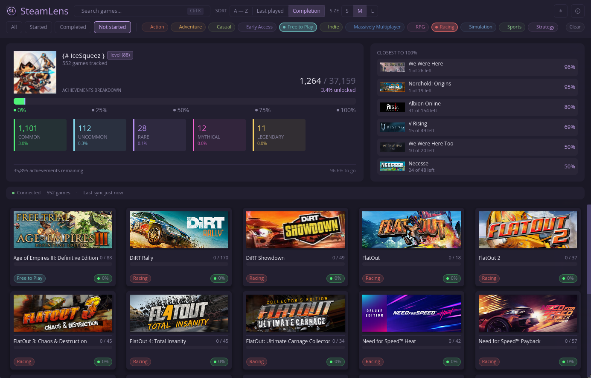

# SteamLens

A Steam achievement manager with rarity insights and library statistics.

[](https://github.com/IceSqueez/steamlens/actions/workflows/ci.yml)
[](https://github.com/IceSqueez/steamlens/releases/latest)
[](https://github.com/IceSqueez/steamlens/releases)

[](https://github.com/IceSqueez/steamlens/releases/latest)
[](https://github.com/IceSqueez/steamlens/releases/latest)
[](https://github.com/IceSqueez/steamlens/releases/latest)

[](LICENSE-MIT)



## Features

### Edit achievements and stats

- **Unlock or re-lock any achievement** with a dirty-state Apply flow and bulk operations — unlock all, lock all, invert selection.
- **Typed `confirmed` gate** before changes hit Steam, so a partial edit never lands by reflex.
- **In-game statistics editor** — view and modify numeric stats (counters, progress trackers, currencies) with bulk Max-all / Reset-all or per-stat controls. Increment-only stats are detected and validated.

### Rarity insights at a glance

- **Five rarity tiers** (Common, Uncommon, Rare, Mythical, Legendary) computed from Steam's live global unlock percentages, with a consistent color palette across every view.
- **Per-game rarity breakdown bar** on every library card — at a glance you see how your unlocked achievements split across tiers; hover any segment for counts.
- **Profile-wide summary** in the library header — aggregate progress totals, rarity-card breakdown, and a "closest to 100%" tile spotlighting titles you're a few unlocks away from completing.

### Works offline, recovers gracefully

- **Read-only Game View without Steam running** — open any previously-scanned game from disk cache and inspect its achievements, icons, and stats schema. Editing locks until Steam reconnects.
- **Failed-scan recovery** — when individual games fail during library scan, a one-click Retry in the status footer re-queues only what failed, not the whole library.
- **Schema-versioned cache** with `change_number`-driven invalidation, so reopens are instant and stale data is detected the moment a game ships an update.

### Polished by default

- **Dark and Light themes** — toggle from the app header; choice persists across restarts.
- **Update checker** — on startup, SteamLens checks GitHub for a newer release and surfaces an info banner with a one-click Download link.
- **Live capsule artwork** at three preset sizes, smooth animations and skeleton placeholders during hydration, search and filter across library and achievements — the basics, kept fast and out of your way.

## Known Limitations (Beta)

- **Linux is the primary test platform.** macOS and Windows binaries build green on CI; manual runtime verification on those platforms lands during beta.1.

## Notes & Caveats

A few things worth knowing before you start:

- **Single-player and personal use.** SteamLens is for inspecting and tweaking achievements on games you own. Think of it as a tool for tinkerers and curious players — not a competitive cheat utility.
- **Not for VAC or server-side anti-cheat games.** Multiplayer titles protected by VAC or server-side validation are out of scope. The server has the final say there, and your changes may simply be ignored.
- **Steam Cloud can overwrite your changes.** If the game was running or Cloud is syncing, the cloud copy can win. Quit the game first, give Cloud a moment to settle, then edit.
- **Some games store progression in stats.** Editing stats can affect quest progress, item unlocks, or save state. The consent checkbox before a stats edit is there for that reason.
- **No warranty.** SteamLens is provided as-is. The author and contributors aren't liable for lost progress, data corruption, or other consequences of running the tool.
- **Not affiliated with Valve.** SteamLens is an independent open-source project — no endorsement by Valve Corporation or Steam.

## Installation

Pre-built binaries are published with each release. Grab the right artifact for your OS from the [latest release page](https://github.com/IceSqueez/steamlens/releases/latest).

### Linux (AppImage)

```bash
chmod +x steamlens-app-*-linux-x64.AppImage
./steamlens-app-*-linux-x64.AppImage
```

AppImage is portable — no install required. Optionally integrate with your desktop using [`AppImageLauncher`](https://github.com/TheAssassin/AppImageLauncher), or move the binary into `~/.local/bin/` and create your own `.desktop` entry.

If the AppImage fails to launch, install the runtime libs for your distro:

```bash
# Ubuntu / Debian
sudo apt install libwayland-client0 libxkbcommon0 libgl1 libfontconfig1

# Fedora
sudo dnf install wayland libxkbcommon mesa-libGL fontconfig

# Arch
sudo pacman -S wayland libxkbcommon mesa fontconfig
```

### macOS (.dmg)

1. Download the `.dmg` for your CPU (`macos-arm64` for Apple Silicon, `macos-x64` for Intel).
2. Open the `.dmg` and drag **SteamLens** into Applications.
3. The first launch is blocked by Gatekeeper because the app is not yet notarized. Workaround:
   - Right-click **SteamLens** → **Open** → confirm in the dialog. macOS remembers the choice for future launches.
   - Or run once from Terminal: `xattr -dr com.apple.quarantine /Applications/SteamLens.app`

### Windows (.exe)

1. Download `steamlens-app-*-windows-x64.exe` and place it anywhere convenient (e.g. `%LOCALAPPDATA%\Programs\SteamLens\`).
2. SmartScreen may warn that the publisher is unknown — click **More info** → **Run anyway**.
3. Double-click to launch. No installer; create your own Start Menu shortcut if you want one.

### From source

```bash
git clone https://github.com/IceSqueez/steamlens.git
cd steamlens
cargo build --release
./target/release/steamlens-app
```

System dependencies on Linux:

```bash
# Ubuntu / Debian
sudo apt install libwayland-dev libxkbcommon-dev libgl1-mesa-dev libx11-dev pkg-config

# Fedora
sudo dnf install wayland-devel libxkbcommon-devel mesa-libGL-devel libX11-devel pkg-config

# Arch
sudo pacman -S wayland libxkbcommon mesa libx11 pkg-config
```

macOS needs [Xcode Command Line Tools](https://developer.apple.com/download/); [Homebrew](https://brew.sh/) is optional. Windows uses the MSVC toolchain — no extra system dependencies.

## Usage

1. **Start SteamLens.** Launch the binary; it splashes and connects to your running Steam client. Without Steam, the library still opens in read-only mode from disk cache.
2. **Browse your library.** Filter by status or genre, change sort order, switch capsule sizes — or just scroll.
3. **Open a game.** Click a card to enter the game view. Cached achievements and icons appear instantly; live data refreshes the moment Steam responds.
4. **Edit achievements.** Click any achievement to toggle it. Changes are tracked locally until you Apply.
5. **Edit stats.** Use the in-game statistics panel to max, reset, or set values directly. Increment-only stats reject decreases.
6. **Apply or discard.** When there are dirty changes, a typed `confirmed` gate guards the Apply button — type the word, click Apply, changes are written to Steam. Cancel drops the changes.
7. **Go back.** The back arrow returns you to the library; the game-view state is cached for next time.

## Architecture

SteamLens is a single-binary desktop app built with **Rust 2024 edition** and the **iced** GUI framework.

The codebase is split into three crates:

- **`steamlens-core`** — Low-level Steam interop (FFI to `steamclient.so` / `.dll`, callback dispatch, schema parsing). No external types leak into its public API.
- **`steamlens-vdf`** — Binary KeyValue parser for Steam's cache format (achievements, stats schema, game metadata). Standalone — can be reused elsewhere.
- **`steamlens-app`** — iced GUI, app state machine, async tasks and subscriptions, theming, and animations.

The runtime uses **tokio** for async work under the hood, driven by iced's task system. Steam interop runs in a worker subprocess (`--worker $APP_ID`) so the main process never has to outlive a Steam pipe handshake.

## Contributing

Found a bug? Have an idea for a feature? Open an issue or PR at [github.com/IceSqueez/steamlens](https://github.com/IceSqueez/steamlens).

**Commit format.** We use [Conventional Commits](https://www.conventionalcommits.org/). Format your commit message as `type(scope): short description`. Example:

```
feat(ui): add keyboard shortcut for Apply
fix(core): handle missing stat values in schema
docs(readme): update README with troubleshooting section
```

Commits are processed by `git-cliff` to generate the [CHANGELOG](CHANGELOG.md) automatically.

## License

Licensed under either of

- Apache License, Version 2.0 ([LICENSE-APACHE](LICENSE-APACHE) or http://www.apache.org/licenses/LICENSE-2.0)
- MIT license ([LICENSE-MIT](LICENSE-MIT) or http://opensource.org/licenses/MIT)

at your option.

### Contribution

Unless you explicitly state otherwise, any contribution intentionally submitted for inclusion in the work by you, as defined in the Apache-2.0 license, shall be dual licensed as above, without any additional terms or conditions.
